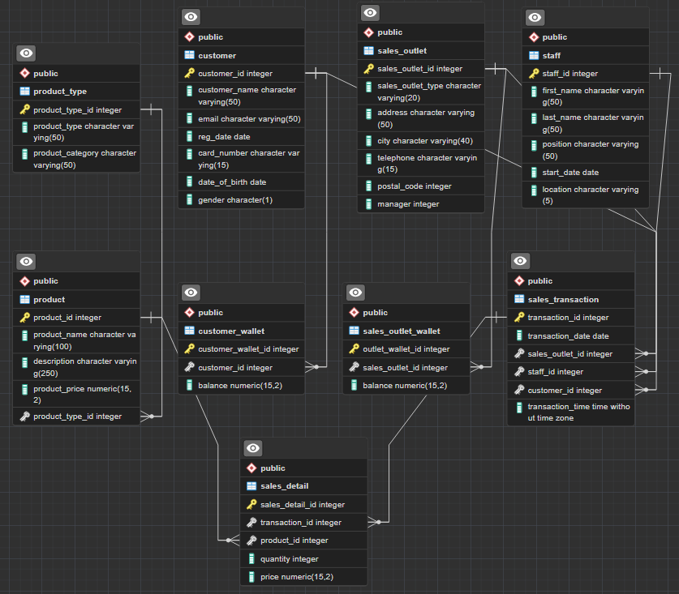

# Coffeeshop Data Cleaning, Structuring, and Modification with PostgreSQL

This repository contains a Python script and multiple SQL scripts that demonstrate my ability to clean, structure, modify, and optimize data using PostgreSQL. The input data is in the form of JSON files in the `starting_json` folder, and can be directly imported into a PostgreSQL database using SQLAlchemy.

I also included dbt model [enhanced_customer.sql](models/enhanced_customer.sql) that you can find inside the `models` folder.

## Project Structure

The project is structured as follows:

- `01_import_from_json_to_postgres.py`: Python script to import data into a PostgreSQL database using SQLAlchemy.
- `02_data_cleaning.sql`: SQL script to clean the imported data, removing inconsistencies or errors.
- `03_join_tables.sql`: SQL script to join tables to minimize redundancy.
- `04_alter_data_types_and_pkeys.sql`: SQL script to alter data types and primary keys to ensure data integrity.
- `05_add_relationships.sql`: SQL script to add relationships between tables.
- `06_create_wallet_tables.sql`: SQL script to create new wallet tables, which are needed for stored procedures.
- `07_wallet_tables_mock_data.sql`: SQL script to populate the newly created wallet tables with mock data.
- `08_validate_constraints.sql`: SQL script to validate the constraints.
- `09_stored_procedures.sql`: SQL script to create two stored procedures to process each new sale.
- `10_create_index.sql`: SQL script to create index on the 'email' column of the 'customer' table
- `11_subquery.sql`: SQL script with subquery to find the total sales amount made by each staff member.
- `execute_all.sh`: Bash script to execute the above Python and SQL scripts automatically in the correct order.
- `models/enhanced_customer.sql`: dbt model that contains the SQL code to create a materialized table with enhanced customer data (with new columns).

The `starting_json` directory contains the JSON files used as the data source.

## How to Use

1. Ensure you have both Python and PostgreSQL installed and running on your machine. For Python, make sure you have pandas, SQLAlchemy, dotenv, and psycopg2
2. Create a new database in PostgreSQL. You also need to create `.env` and `.pgpass` files in the root directory with your PostgreSQL database configuration (for the format, check my `.env.example`)
3. From your terminal, you can run all the Python and SQL scripts automatically by executing the Bash script `execute_all.sh`. To execute the Bash script, use the command `bash execute_all.sh`. Make sure to use the correct username and password. Note: This Bash script is optimized for Linux, you may have to slightly change the script if you use Windows.

Alternatively, you can run the Python and SQL scripts one-by-one if you don't want to execute the Bash script:
1. Begin with `01_import_from_json_to_postgres.py` to import the data from the JSON files into your PostgreSQL database.
2. You can use pgAdmin or psql to execute the SQL scripts in the order they are numbered, starting from `02_data_cleaning.sql`. Each script performs a specific task and they should be run in sequence to ensure the data is cleaned, structured, and transformed correctly.

After you create the stored procedures with `09_stored_procedures.sql`, you can test the procedures by using this statement => ```CALL public.process_sale(product_id, quantity, customer_wallet_id, outlet_wallet_id, staff_id);``` (replace the parameters with the existing numbers in the tables)

As for the dbt model, you can simply use `dbt run` to create the materialized table with enhanced customer data.

## Entity Relationship Diagram (ERD)

The `final_erd.pgerd` file contains the Entity Relationship Diagram (ERD) for the final database structure. You can load this file into pgAdmin to visualize the database schema. Here's the ERD screenshot:


## Original Dataset

The input data (the JSON files in the `starting_json` folder) originally came from [IBM Coffee Shop sample data](https://community.ibm.com/community/user/businessanalytics/blogs/steven-macko/2019/07/12/beanie-coffee-1113), but I've mixed some values and introduced unnecessary characters, creating a 'dirtier' dataset. I did this on purpose, so I can demonstrate my SQL data cleaning abilities in this repo.
